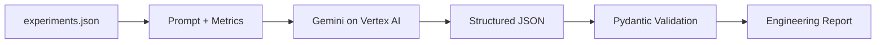
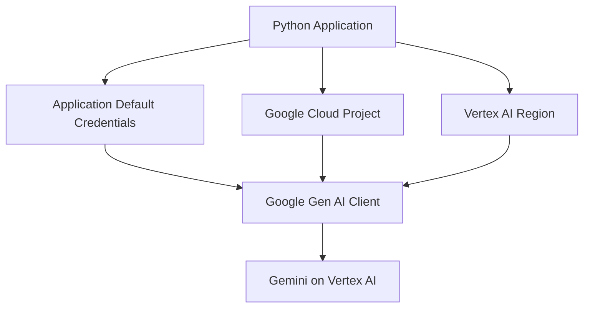

# ML Experiment Reporter

> **FZ / GCP AI DOSSIER 01**  
> Structured experiment review · Gemini on Vertex AI · Google Gen AI SDK · Pydantic

A standalone Vertex AI demo that converts **synthetic machine-learning experiment metrics** into a typed engineering summary.

This repository was created specifically as a public engineering example. It is not extracted from, adapted from, or intended to reproduce any employer system.

---

## SYSTEM RECORD

| | |
| --- | --- |
| **Platform** | Vertex AI |
| **Model access** | Google Gen AI SDK |
| **Authentication** | Google Application Default Credentials |
| **Output format** | Structured JSON |
| **Validation** | Pydantic |
| **Temperature** | `0.1` |
| **Grounding rule** | Conclusions must use only supplied metrics and notes |
| **Input data** | Entirely synthetic |

---

## 01 / REPORTING FLOW



```text
SYNTHETIC METRICS
        │
        ▼
 GEMINI / VERTEX AI
        │
        ▼
 STRUCTURED RESPONSE
        │
  ┌─────┼───────────────┐
  ▼     ▼               ▼
BEST  TRADEOFFS   NEXT EXPERIMENTS
        │
        ▼
 RECOMMENDATION
```

---

## 02 / OUTPUT CONTRACT

```text
ExperimentSummary
├── best_overall_candidate
├── summary
├── tradeoffs[]
├── recommendation
└── next_experiments[]
```

```python
class ExperimentSummary(BaseModel):
    best_overall_candidate: str
    summary: str
    tradeoffs: list[str]
    recommendation: str
    next_experiments: list[str]
```

The response is generated as JSON and then validated again in Python with Pydantic.

---

## 03 / GROUNDING RULE

The system instruction requires the model to:

```text
Base every conclusion only on the supplied metrics and notes.
Do not invent benchmark results.
```

```text
SUPPLIED METRICS
      │
      ▼
 ANALYSIS ONLY
      │
      X
 NO INVENTED BENCHMARKS
```

The model acts as an experiment reviewer rather than a source of new performance data.

---

## 04 / VERTEX CLIENT



The client uses:

```text
vertexai = true
api_version = v1
```

Required configuration:

- `GOOGLE_CLOUD_PROJECT`
- `VERTEX_MODEL`

Optional configuration:

- `GOOGLE_CLOUD_LOCATION` — defaults to `us-central1`

---

## 05 / GENERATION PROFILE

```text
TEMPERATURE          0.1
MIME TYPE            application/json
SCHEMA               ExperimentSummary
VALIDATION           Pydantic
DATA SOURCE          experiments.json
```

The low temperature is appropriate for a constrained engineering-summary task where consistency matters more than creative variation.

---

## 06 / FAILURE PATHS

```text
MISSING PROJECT / MODEL ENV
            │
            ▼
       RuntimeError

MISSING EXPERIMENT FILE
            │
            ▼
     FileNotFoundError

EMPTY VERTEX RESPONSE
            │
            ▼
       RuntimeError

INVALID STRUCTURE
            │
            ▼
    Pydantic validation
```

---

## 07 / REPOSITORY SHAPE

```text
ml-experiment-reporter/
├── experiments.json
├── app.py
├── requirements.txt
├── .gitignore
└── README.md
```

---

## 08 / RUN LOCALLY

```bash
python3 -m venv .venv
source .venv/bin/activate
pip install -r requirements.txt
```

Configure Google Application Default Credentials. For local development:

```bash
gcloud auth application-default login
```

Set:

```bash
export GOOGLE_CLOUD_PROJECT="YOUR-PROJECT-ID"
export GOOGLE_CLOUD_LOCATION="us-central1"
export VERTEX_MODEL="YOUR-MODEL-NAME"
```

Run:

```bash
python3 app.py
```

---

## 09 / WHAT THIS DEMONSTRATES

```text
VERTEX AI
    │
    ├── Gemini model access
    └── regional cloud configuration

STRUCTURED GENERATION
    │
    ├── JSON response schema
    └── Pydantic validation

ENGINEERING REVIEW
    │
    ├── best candidate
    ├── tradeoffs
    ├── recommendation
    └── next experiments

PUBLIC-SAFE DATA
    │
    └── synthetic metrics only
```

---

## 10 / PUBLIC-DEMO NOTE

All model names, metrics, latency values, and notes included in this repository are synthetic and exist only for demonstration purposes.

The repository is intentionally compact: the emphasis is on a clean GCP AI integration with typed output and grounded analysis.

---

<div align="center">

**FZ / GCP · VERTEX AI · STRUCTURED ANALYSIS**

`METRICS → GEMINI → VALIDATED ENGINEERING REPORT`

</div>
